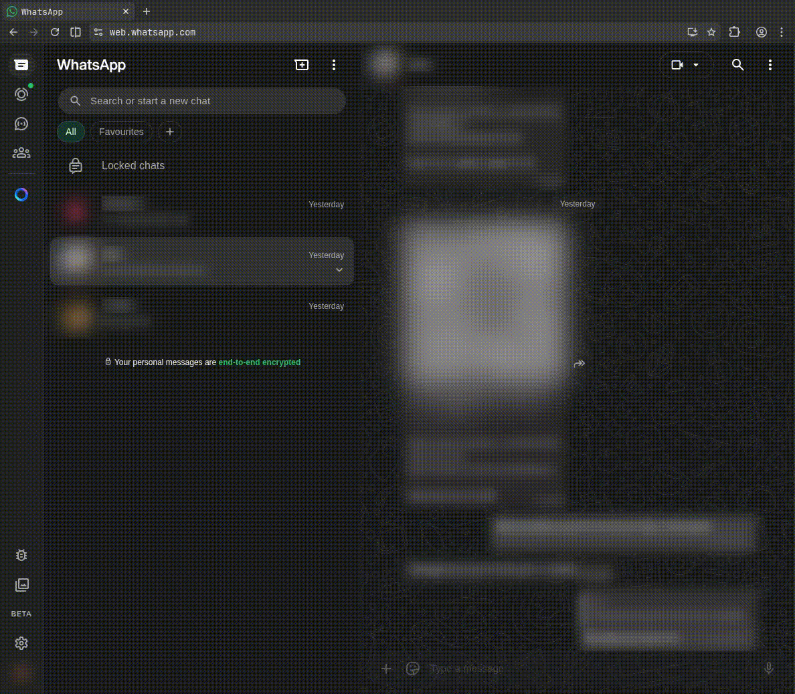

# WWST - WhatsApp Web Sidebar Toggle

A lightweight browser extension to collapse the chat sidebar on WhatsApp Web.

## How it Works

- **Collapse:** Click the chat tab to hide the left sidebar.
- **Restore:** Click the same tab again to bring it back.

### Hotkeys

- **Collapse/Restore:** `Ctrl + B` (Windows/Linux) or `Cmd + B` (Mac)

## Installation

### Chrome / Edge / Brave

1. Clone or download this folder.
2. Go to `chrome://extensions/` (or your browser's equivalent).
3. Enable "Developer mode" in the top right.
4. Click "Load unpacked" and select the directory containing the `manifest.json` and `content.js` file.

### Firefox

1. Clone or download this folder.
2. Go to `about:debugging#/runtime/this-firefox`.
3. Click "Load Temporary Add-on" and select the `manifest.json` file.

